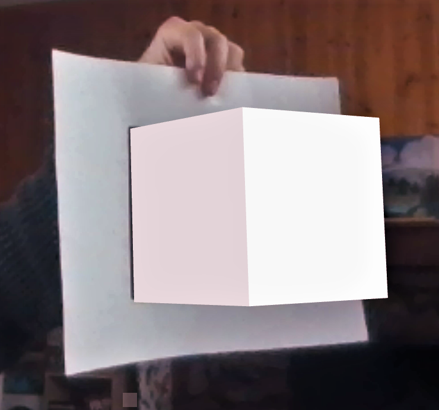

# Week 1 - Basic A-Frame/AR.js/Glitch Demo

## Overview

### Team Members

- Gray Assi: UX Lead
- Celine Nakpil: Programming Lead

### Timeline

19 January 2023 - 25 January 2023

### MVP Functions

- [x] Make an A-frame + AR.js demo using the internal laptop camera
- [x] Make basic cube shape in A-frame to appear when a shape/image tag is seen

### Stretch Goals

- [ ] ~~Get cube to be "in" the paper cube rather than "on top" of the tag on the cube~~
- [ ] ~~Have a different shape appear in A-frame depending on which tag is shown to the camera~~
- [ ] Track multiple tags on the camera at the same time

---

## Process

### 19 Jan 2023

To start this project, I am following an older guide by Alexandra Etienne to get basic hiro tag recognition working. It looks like something has changed since the article was written in 2017, so I'll need to figure out why the hiro tag isn't being registered. On the bright side, I've got the internal laptop camera working which is a lovely start.

FIGURED IT OUT - the hiro tag needed to be on a white background for the tag to be recognized. Easy enough fix! Next step: print one of our paper cubes and figure out how to make the tag recognized a shape instead of the hiro tag.

### 20 Jan 2023

So that definitely did not happen as other obligations took priority to hash out. I have done further research on how to use different tags with AR.js and how one might use custom letter tags. I need to look into creating a basic cube in blender and giving each side of the cube its unique letter that I can map to the physical paper cube.

### 25 Jan 2023

Had to take a pause because I accidentally scope creeped too hard and scared myself a little. I was trying to make a live mimic'd motion between the paper cube and the virtual cube when all I really needed to do was orient the cube on screen between static rotational states based on the tag that is shown to the camera. This will be a custom event that I set in A-Frame and I will need to figure out if I need to program the animation between the cube's sides or if AR.js will do it for me.

---

## Sources

- [A-Frame Documentation](https://aframe.io/docs/1.4.0/introduction/)
- [AR.js Documentation](https://ar-js-org.github.io/AR.js-Docs/)
- [A-Frame/AR.js Guide](https://aframe.io/blog/arjs/)
- [A-Frame/AR.js Demo](https://medium.com/arjs/augmented-reality-in-10-lines-of-html-4e193ea9fdbf)
- [A-Frame/AR.js Image Tracking and Location Tracking Guide](https://aframe.io/blog/arjs3/)
