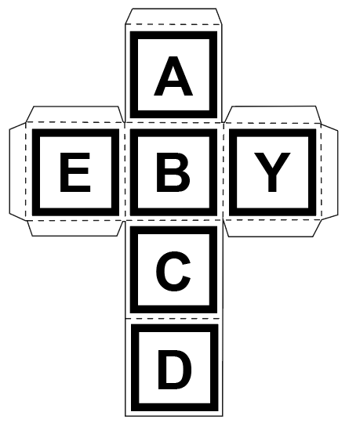

# Week 2 - Focus on Dev for Static Position Demo

## Overview

### Team Members

- Gray Assi: UX Lead
- Celine Nakpil: Programming Lead

### Timeline

26 January 2023 - 01 February 2023

### MVP Functions

- [x] Make the cube in blender with the raised letters on the sides
- [x] Have the cube be persistent/exist on the screen independent of a qr code
- [x] Swap the image tag to use letters instead of hiro tags

### Stretch Goals

- [x] Swap the blender cube into the current existing demo
- [ ] Prototype the custom AR.js events for basic rotation between two faces
- [ ] Figure out how to hide the live camera feed, either by covering it with another layer or removing it completely
- [ ] ~~Track multiple tags on the camera at the same time~~

---

## Process

### Learning Blender

Put myself through a quick crash course in Blender to learn enough to make a 3D cube with embossed sides, matching to the paper cutout cube that Gray made. I actually really love the controls for Blender! Super intuitive once I got the hang of the hotkeys.

Then, I figured out how to make a quick rotation animation for documentation and also general Blender knowledge purposes.

### Importing to A-Frame

### Creating Custom Markers

Since we need rotationally asymmetric markers that are also easily identified as unique from other faces for the paper cube, we chose to go with letters to denote the paper cube's orientation. Therefore, I needed to train AR.js to recognize the custom markers and also convert the letters on the cube template to actual markers.

AR markers (for my purposes and for the AR.js library) can be any image as long as it is not rotationally symmetrical. Thus, by choosing letters that are distinct in shape from one another and also rotationally asymmetrical, we can make a cube with distinct sides to both humans and the algorithm.

After using the tool to train AR.js, I have the required pattern files (.patt files) I need to program into the software that should track the custom letter markers on the cube.

---

## Sources

- [How to Emboss a Blender Object](https://youtu.be/lc3d0pM2fpo)
- [Animate Rotating Object in Blender](https://youtu.be/6oXkRIN_t0Y)
- [Rotate an A-Frame Object](https://github.com/aframevr/aframe/blob/master/docs/components/rotation.md)
- [Create a Custom AR.js Marker](https://medium.com/arjs/how-to-create-your-own-marker-44becbec1105)
- [Train AR.js Custom Marker Tool](https://ar-js-org.github.io/AR.js/three.js/examples/marker-training/examples/generator.html)
