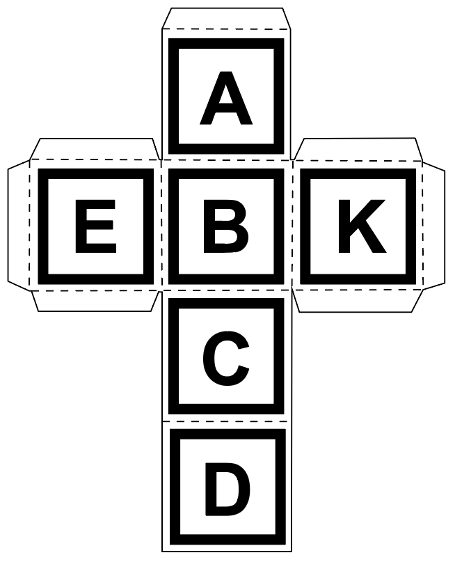

# Week 3 - Learning A-Frame

## Overview

### Team Members

- Gray Assi: UX Lead
- Celine Nakpil: Programming Lead

### Timeline

02 February 2023 - 08 February 2023

### MVP Functions

- [x] Load and track multiple tags on the camera at the same time
- [x] Swap marker tag 'Y' for 'K' because 'Y' and 'A' are too similar in form
- [x] Update the Blender model with new letter
- [ ] Make documentation .gifs
- [ ] Place the blender cube into the A-frame scene
- [ ] Begin prototyping custom AR.js events to manipulate cube rotation position

### Stretch Goals

- [ ] Refine the Blender model to match SketchUp branding
- [ ] Style A-Frame to mimic SketchUp online workspace
- [ ] Figure out how to hide the live camera feed, either by covering it with another layer or removing it completely

---

## Process

### Debugging AR Markers

After loading all the markers into the project, the algorithm kept confusing 'Y' and 'A'. Thus, we swapped 'Y' for 'K'. We might need to swap 'E' or 'B' since their character forms are also very similar, but we'll cross that bridge when we get to it.

### Beginning Dev on Software

With the hardware interaction having advanced enough, it's time to start focusing on producing the interactions that we actually want our users to have. This means creating a scene in A-Frame, independent of the AR camera frame and prototyping custom AR.js events to affect the rotational data of objects in that scene.

---

## Sources

-[A-Frame rotating StackOverflow](https://stackoverflow.com/questions/57757101/how-to-make-spinning-rotate-an-entity-in-a-frame)
