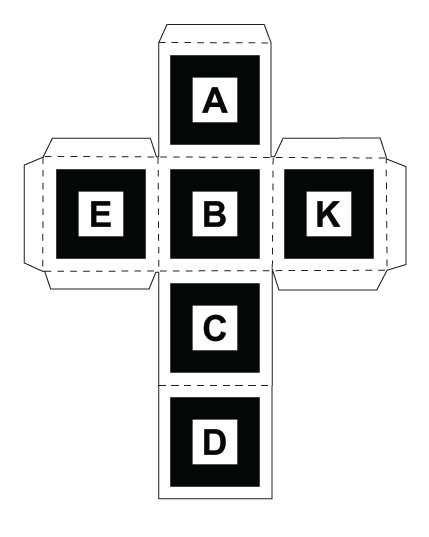

# Week 8 - Tentative Success

## Overview

### Team Members

- Gray Assi: UX Lead
- Celine Nakpil: Programming Lead

### Timeline

02 March 2023 - 08 March 2023

### MVP Functions
- [x] Make new cube template with fatter ratio(.5) on the tags to make them easier for the program to spot
- [x] Continue refining AR Cube demo
- [x] Deploy demo to a public link
- [x] Test demo on SketchUp provided laptops

### Stretch Goals
- [ ] Work on making the Figma prototype clickable and interactive for future HX testing

---

## Process

After a several rough weeks in a row, I finally had the space to experiment and work through several todo items that I was severely behind on! Success always feels good, especially after a rough patch.

### Remaking the Cube Template

It's likely that after testing, we may need to update the template again based on any observations that we might make during our next round of HX testing. However, for now the markers have been reverted back to a 50% ratio from marker to border. In theory, this makes it easier for the algorithm to sense the pattern, especially if there is any sort of faulty construction on the edges.

Tech stack: [AR.js Marker Training (must use jpg files)](https://jeromeetienne.github.io/AR.js/three.js/examples/marker-training/examples/generator.html), Adobe Photoshop, Adobe Illustrator

 

### Cube Demo Refinements

Previous cube demo:

Current cube demo:

Most obvious difference is that the cube is now mimic-ing the motion of the paper cube significantly better than before; that is to say that it's actually doing it, which wasn't at all what was happening before. I am also able to be much less careful with my finger placements overall. As long as I'm not covering the face that the algorithm is locked onto, the cube will continue to be shown uninterrupted.

The biggest barrier to this interaction was getting the other marker cubes out of the way. I'm sure there's a better way to get this interaction, but the one I went with effectively modifies the html of the page based on which markers are visible to the camera.

In short, if the program sees marker 'a' first, it will "lock" onto that marker and ignore any other marker it sees until it loses track of that marker. 

This interaction is reached through a series of if statements and binary switches. The cubes for the other markers in view of the camera are still appearing - they've simply set to be completely transparent. All the cubes are transparent unless it is associated with the "locked-on" cube, which is why only one cube is appearing at a time.

It's not perfect - the algorithm sometimes gets the "locked-on" marker wrong or misinterprets rotation, but it might be the closest thing to our original pitch for the cube interaction that we can get. This solution leverages the marker tracking of AR.js and the 3D rendering capabilities of A-frame to make something close to a functional prototype.

 

### Deploying a Public Demo

I have successfully deployed the demo to the hosting platform Vercel. The non-static nature of the website wasn't playing well with GitHub pages and required a more powerful solution. Netlify and Vercel were the next best options but since I've previously worked with Vercel, I chose it over Netlify.

[Live demo link](https://capstone-sketchup.vercel.app/)

[Grab the updated cube template here to make your own cube!](https://drive.google.com/file/d/1jX7v26jv4dPdl_D-4LgsChnyvkQuPBX2/view?usp=share_link)

 

### Testing Demo on SketchUp Laptops

After getting the public demo up, I pulled out the Chromebooks from SketchUp to see if it would work on their machines.

Since this is an entirely browser-based prototype that doesn't have any sort of computing requirements, I wasn't terribly worried that it wouldn't work. And thankfully, I was right! The program worked just as well on the Chromebooks as it did on my home computer. 

---

## Next Steps

A lot of progress was made this week, but the AR cube still has things to refine or at least explore to see the limitations of the tech. I also still need to try and make an interactive prototype of Gray's UX work so far to make a demo with less interference from us as interviewers.

### Goals for Next Week

- Try substituting in the Blender cube from several weeks ago and see what the rotation is actually doing. The current ambiguity is nice, but if we can make a more realistic interaction with a non-uniform object, that would be awesome.
- Make the UX prototype fully clickable.
